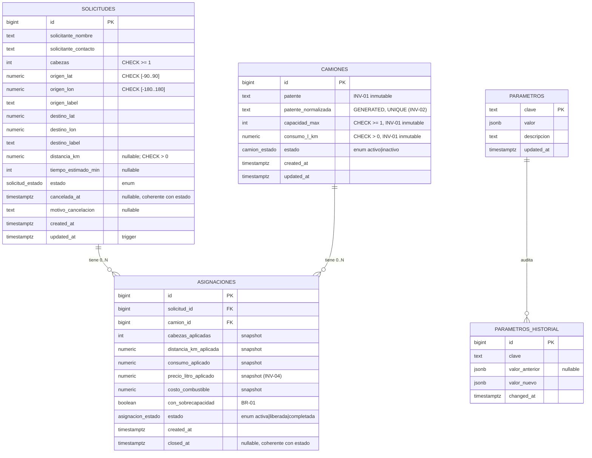

# DOCUMENTACION.md — BoviTrans MVP

> Documentación técnica de la solución. Acompaña a [`BACKLOG.md`](BACKLOG.md)
> (discovery y backlog) y a [`.claude/skills.json`](.claude/skills.json) (skill
> formal del proyecto).

---

## Índice

1. [Arquitectura general](#1-arquitectura-general)
2. [Modelo de datos](#2-modelo-de-datos)
3. [API REST](#3-api-rest)
4. [Frontend](#4-frontend)
5. [Cálculos y reglas de negocio implementadas](#5-cálculos-y-reglas-de-negocio-implementadas)
6. [Cómo correr el proyecto](#6-cómo-correr-el-proyecto)
7. [Variables de entorno](#7-variables-de-entorno)
8. [Estrategia de testing](#8-estrategia-de-testing)
9. [Decisiones arquitectónicas (ADR-lite)](#9-decisiones-arquitectónicas-adr-lite)
10. [Roadmap post-MVP](#10-roadmap-post-mvp)

---

## 1. Arquitectura general

### 1.1 Diagrama de componentes

```
┌──────────────────────────────────────────────────────────────────────────┐
│                              Operador Logístico                          │
│                              (navegador / desktop)                       │
└─────────────────┬────────────────────────────────────────────────────────┘
                  │ HTTPS (local: HTTP)
                  ▼
┌──────────────────────────────────────────────────────────────────────────┐
│                              Next.js 14  (app)                           │
│                                                                          │
│  ┌────────────────────┐  ┌───────────────────┐  ┌────────────────────┐   │
│  │  Server Components │  │  Route Handlers   │  │  Client Components │   │
│  │  (SSR pages)       │  │  /api/*           │  │  (forms, mapas)    │   │
│  └─────────┬──────────┘  └─────────┬─────────┘  └─────────┬──────────┘   │
│            │                       │                      │              │
│            └───────────┬───────────┘                      │              │
│                        ▼                                  ▼              │
│             ┌──────────────────────┐         ┌─────────────────────┐     │
│             │  lib/domain  (puro)  │         │ lib/client          │     │
│             │  · cost              │◀────────│ · api-client (fetch)│     │
│             │  · capacity          │         │ · format            │     │
│             │  · patente           │         └─────────────────────┘     │
│             └──────────┬───────────┘                                     │
│                        │                                                 │
│             ┌──────────▼───────────┐  ┌─────────────────────┐            │
│             │  lib/repositories +  │  │  lib/services       │            │
│             │  lib/db (pg)         │  │  · routing (OSRM)   │            │
│             │                      │  │  · geocoding(Nomi.) │            │
│             └──────────┬───────────┘  └─────────┬───────────┘            │
└────────────────────────┼──────────────────────┼──────────────────────────┘
                         │                      │ HTTPS
                         ▼                      ▼
              ┌─────────────────────┐   ┌─────────────────────┐
              │   PostgreSQL 16     │   │  OSRM público       │
              │   (db container)    │   │  Nominatim público  │
              │                     │   │  (OpenStreetMap)    │
              │  · 5 tablas         │   └─────────────────────┘
              │  · 3 enums          │
              │  · triggers         │
              │  · vista dashboard  │
              └─────────────────────┘
```

### 1.2 Capas y responsabilidades

| Capa | Carpeta | Responsabilidad |
|---|---|---|
| **UI Pages (SSR)** | `app/(dashboard)/**/*.tsx` | Server Components que consultan DB directo para listados. Capa de presentación. |
| **UI Forms / Maps** | `**/*Form.tsx`, `components/map/*` | Client Components con estado e interactividad (Leaflet, geocoding autocomplete, cálculo en vivo). |
| **API REST** | `app/api/**/route.ts` | Route Handlers de Next.js. Boundary externo del sistema. Manejo de HTTP, validación con Zod, mapping de errores. |
| **Lógica de dominio (pura)** | `lib/domain/` | Funciones puras testeadas: cálculo de costo, evaluación de capacidad, normalización de patente. **No** depende de DB, HTTP ni I/O. |
| **Repositorios** | `lib/repositories/` | Acceso de alto nivel a datos cuando hay lógica de agregación (ej. settings con historial). |
| **DB client** | `lib/db/client.ts` | Pool `pg` (lazy), helper `query()` y `withTransaction()`. |
| **Servicios externos** | `lib/services/` | Wrappers de OSRM (routing) y Nominatim (geocoding) con failure modes explícitos. |
| **Validators** | `lib/validators/` | Zod schemas compartidos cliente/servidor. |
| **API client** | `lib/client/api-client.ts` | Wrapper de `fetch` con `ApiClientError` tipado por código semántico. |

### 1.3 Flujo de una asignación (camino crítico del MVP)

```
[UI: AssignForm] ──POST /api/assignments──▶ [Route Handler]
                                                 │
                                                 ▼
                                    ┌─ Zod (AsignacionCreateSchema)
                                    │
                                    ▼
                            withTransaction(client) {
                              SELECT solicitud FOR UPDATE
                              SELECT camion    FOR UPDATE
                              fetch fuel_price actual (snapshot)
                              ──▶ lib/domain/cost.calcularCostoCombustible
                              ──▶ lib/domain/capacity.evaluarSobrecapacidad
                              INSERT asignaciones (...)
                              UPDATE solicitudes SET estado='asignada'
                            }
                                                 │
                                                 ▼
                              { data: AsignacionDTO, alerta_sobrecapacidad? }
                                                 │
                                                 ▼
                          [UI] router.push(/requests/:id) → re-renderiza
```

---

## 2. Modelo de datos

### 2.1 Entity–Relationship (Mermaid)



### 2.2 Restricciones e índices clave

| Mecanismo | Dónde | Qué garantiza |
|---|---|---|
| **GENERATED COLUMN** `patente_normalizada` | `camiones` | INV-02: unicidad real (no depende de que la app normalice). |
| **UNIQUE INDEX** sobre `patente_normalizada` | `camiones` | INV-02. |
| **Trigger** `prevent_camion_immutable_fields_update` | `camiones` | INV-01. Validado en runtime: el intento de UPDATE crudo de `capacidad_max` lanza `INV-01: capacidad_max es inmutable`. |
| **UNIQUE INDEX parcial** `WHERE estado='activa'` | `asignaciones (solicitud_id)` y `asignaciones (camion_id)` | INV-03: máximo una asignación activa por solicitud y por camión simultáneamente. |
| **CHECK** constraints | `camiones`, `solicitudes`, `asignaciones` | INV-05: positividad de cabezas, distancia, consumo, precio. |
| **CHECK** de coherencia | `solicitudes` (`cancelada_at` coherente con `estado='cancelada'`), `asignaciones` (`closed_at` coherente con `estado!='activa'`) | Imposibilita estados sin sentido. |
| **Trigger** `parametros_audit` | `parametros` | INV-04 indirecta: cada UPDATE genera fila en `parametros_historial`. |
| **Trigger** `set_updated_at` | `camiones`, `solicitudes`, `parametros` | Mantiene `updated_at` sin tocar la app. |
| **Vista** `v_solicitudes_dashboard` | (read-only) | Payload denormalizado del dashboard (solicitud + asignación activa + camión asignado en una sola consulta). |

### 2.3 Decisiones de diseño de la DB

- **Enums en DB, no tablas de lookup.** Los estados son parte del dominio, estables y pocos. Si en el futuro se vuelven configurables (ej. estados custom por cliente), se migran a tablas con FK.
- **Snapshot persistido en `asignaciones`** en lugar de joins en tiempo de lectura. Garantiza que cambios futuros de precio del combustible o de los atributos del camión (aunque sean inmutables) no alteren los costos históricos. INV-04.
- **JSONB para `parametros`** en vez de columnas tipadas. Permite agregar parámetros futuros sin migrations de schema. El precio de combustible es `{ amount, currency }`.
- **Validación en DB Y en API.** La DB es la última línea de defensa: trigger de inmutabilidad, CHECK constraints, UNIQUE parciales. La API valida primero con Zod por UX (mensajes claros, sin esperar el error de pg).
- **`numeric` para coordenadas y montos**, no `double precision`. Evita errores de redondeo en latitudes/longitudes y en cálculo financiero.

---

## 3. API REST

### 3.1 Convenciones

- Base path: `/api`.
- Nombres de recursos: plural en kebab-case (`/api/transport-requests`, `/api/trucks`, `/api/assignments`).
- Envelope de respuesta exitosa: `{ data: <recurso> }` (opcionalmente acompañado de metadata como `total`, `alerta_sobrecapacidad`).
- Envelope de error: `{ error: { code, message, details? } }`.
- Status codes: `200` (read), `201` (create), `204` (delete / acción exitosa sin contenido), `400` (validación), `404` (no encontrado), `409` (conflicto de invariante), `422` (regla de negocio), `500` (interno).

### 3.2 Tabla de endpoints

| Método | Path | Descripción | Cubre |
|---|---|---|---|
| GET | `/api/healthz` | Health check (proceso + DB). | E06 |
| GET | `/api/trucks` | Lista la flota con filtro opcional `?estado=activo\|inactivo`. | US-07 |
| POST | `/api/trucks` | Registra un nuevo camión. | US-06 |
| GET | `/api/trucks/:id` | Detalle + histórico de asignaciones + agregados. | US-09 |
| PATCH | `/api/trucks/:id` | Cambia sólo `estado` (activo↔inactivo). | US-08 |
| GET | `/api/transport-requests` | Lista solicitudes desde la vista del dashboard. | US-01 |
| POST | `/api/transport-requests` | Crea solicitud. Calcula ruta vía OSRM con fallback. | US-02, BR-03 |
| GET | `/api/transport-requests/:id` | Detalle (incluye asignación activa si tiene). | US-03 |
| POST | `/api/transport-requests/:id/cancel` | Cancela y libera asignación activa si existe. | US-04 |
| POST | `/api/transport-requests/:id/recalculate-route` | Re-calcula ruta cuando la primera falló. | US-12 |
| POST | `/api/assignments` | Asigna camión: cálculo + snapshot + alerta. | US-13, US-14, US-15, BR-04 |
| POST | `/api/assignments/:id/release` | Libera asignación activa, vuelve solicitud a pendiente. | US-16 |
| GET | `/api/settings/fuel-price` | Precio actual. | US-17 |
| PUT | `/api/settings/fuel-price` | Actualiza precio (audit auto). | US-17 |
| GET | `/api/settings/fuel-price/history` | Historial de cambios. | US-18 |
| GET | `/api/geocoding/search?q=` | Proxy a Nominatim (con User-Agent). | US-11 |
| GET | `/api/geocoding/reverse?lat=&lon=` | Reverse geocoding. | US-11 |

### 3.3 Mapeo de errores

| Origen | Trigger | Respuesta |
|---|---|---|
| Zod fail | Schema rechaza body | `400 VALIDATION_ERROR` con `details.fieldErrors`. |
| `notFound()` | Recurso no existe | `404 NOT_FOUND`. |
| `conflict()` | Manual (ej. solicitud ya asignada) | `409 CONFLICT`. |
| `businessRule()` | Regla de negocio rechaza | `422 BUSINESS_RULE`. |
| Postgres `23505` (unique_violation) | Patente duplicada / asignación activa repetida | `409 CONFLICT` con `details.constraint`. |
| Postgres `23514` (check_violation) | CHECK constraint o trigger de inmutabilidad | `422 BUSINESS_RULE`. |
| Resto | Excepción no manejada | `500 INTERNAL_ERROR`. En prod, sin stacktrace. |

### 3.4 Ejemplos

**POST `/api/trucks`**

```bash
curl -X POST http://localhost:3000/api/trucks \
  -H 'Content-Type: application/json' \
  -d '{"patente":"BVT 001","capacidad_max":60,"consumo_l_km":0.50}'

# 201
# { "data": { "id": 5, "patente": "BVT 001", "patente_normalizada": "BVT001",
#             "capacidad_max": 60, "consumo_l_km": 0.5, "estado": "activo", ... } }
```

**POST `/api/assignments`**

```bash
curl -X POST http://localhost:3000/api/assignments \
  -H 'Content-Type: application/json' \
  -d '{"solicitud_id":1,"camion_id":1}'

# 201
# { "data": { "id": 3, "solicitud_id": 1, "camion_id": 1,
#             "cabezas_aplicadas": 40, "distancia_km_aplicada": 352.4,
#             "consumo_aplicado": 0.42, "precio_litro_aplicado": 8000,
#             "costo_combustible": 1184064, "con_sobrecapacidad": false,
#             "estado": "activa", ... },
#   "alerta_sobrecapacidad": null }
```

**POST `/api/assignments` con sobrecapacidad sin confirmar**

```bash
curl -X POST http://localhost:3000/api/assignments \
  -H 'Content-Type: application/json' \
  -d '{"solicitud_id":5,"camion_id":3}'

# 422
# { "error": { "code": "BUSINESS_RULE",
#              "message": "Sobrecapacidad: 60 cabezas exceden la capacidad 35.",
#              "details": { "excedente": 25, "viajes_necesarios": 2,
#                           "sugerencia": "Re-envía con acepta_sobrecapacidad=true ..." } } }
```

---

## 4. Frontend

### 4.1 Rutas

```
/                          → Panel principal (solicitudes del dashboard)
/?estado=pendiente         → Mismo dashboard con filtro
/requests/new              → Nueva solicitud (form + MapPicker)
/requests/:id              → Detalle con mapa + acciones
/requests/:id/assign       → Selector de camión + cost preview en vivo
/fleet                     → Listado de la flota (tabla)
/fleet/new                 → Registro de nuevo camión
/fleet/:id                 → Detalle + histórico + agregados
/settings                  → Precio combustible + historial
```

### 4.2 Server Components vs Client Components

- **Server Components** (default): páginas que sólo leen — Dashboard, Fleet listado, Settings, detalles. Consultan DB con `query()` directamente.
- **Client Components** (`'use client'`): forms, mapas, todo lo interactivo. Se comunican con la API REST a través de `lib/client/api-client.ts`.

### 4.3 Integración de mapas (Leaflet)

- Wrappers (`RouteMap`, `MapPicker`) usan `next/dynamic` con `ssr: false` porque Leaflet necesita `window`.
- El fix de íconos `default` (`L.Icon.Default`) se aplica una sola vez en `components/map/leaflet-icons.ts` mediante `ensureLeafletIconsPatched()`. Las URLs se mapean a unpkg para evitar problemas de webpack.
- Iconos de origen (verde) y destino (rojo) generados como SVG inline para no requerir assets binarios.
- Routing real consultado a OSRM público desde el cliente para no acoplar el SSR con el servicio externo; si OSRM falla, se dibuja una línea recta y se muestra un warning.

### 4.4 Estilo y UX

- **Tailwind** con paleta de marca (`brand-*` en verdes campo) y tokens de estado (`status-pendiente`, `status-asignada`, etc.).
- **Chips de estado** con color + texto (accesible — no se depende sólo del color).
- **Empty states** con CTA en todas las listas vacías.
- **Capacity alert** escalonada visualmente: verde "ok", verde con texto "ajuste exacto", rojo con sugerencia.
- **Doble confirmación** vía `confirm()` cuando se asigna con sobrecapacidad.
- **Inmutabilidad visible**: en el detalle de camión los campos críticos llevan un candado con tooltip.

---

## 5. Cálculos y reglas de negocio implementadas

### 5.1 Cálculo de costo de combustible (BR-04, US-14)

```
costo = distancia_km × consumo_l_km × precio_litro
```

Implementado en [`lib/domain/cost.ts`](lib/domain/cost.ts):
- Función pura `calcularCostoCombustible({ distanciaKm, consumoLKm, precioLitro })`.
- Valida inputs positivos y finitos; lanza error en otro caso.
- Redondeo a 2 decimales con corrección de epsilon.
- Tests: caso nominal del BACKLOG, redondeo de centavos, edge cases (0, negativos, NaN, Infinity).

**Acoplado a la UI** vía `useMemo` en `AssignForm`: al cambiar el camión seleccionado, el costo se recalcula sin llamar a la API. La API recalcula del lado servidor antes de persistir (defensa en profundidad).

### 5.2 Evaluación de sobrecapacidad (BR-01, US-15)

Implementado en [`lib/domain/capacity.ts`](lib/domain/capacity.ts):
- `evaluarSobrecapacidad(cabezas, capacidad)` → `{ excedida, excedente, viajesNecesarios, capacidadSobrante }`.
- `sugerirCamionesAlternativos(cabezas, camiones[])` → ordenados por mejor ajuste (menor sobra primero).
- Tests: cabezas < capacidad, igual, > capacidad, sobrecapacidad masiva, alternativos vacíos, exact-fit.

**Aplicación**:
- UI: banner verde / rojo + lista de alternativos sugeridos.
- API: si `excedida && !acepta_sobrecapacidad` → 422 con sugerencia. Si confirmado → persistir con `con_sobrecapacidad = TRUE` para auditoría.

### 5.3 Normalización de patente (INV-02)

Implementado en [`lib/domain/patente.ts`](lib/domain/patente.ts) Y en la columna GENERATED de la DB. La duplicidad es deliberada — la app da UX rápida (preview en el form), la DB es la fuente de verdad de unicidad.

### 5.4 Snapshot de asignación (INV-04)

Cada asignación persiste 5 columnas snapshot (`cabezas_aplicadas`, `distancia_km_aplicada`, `consumo_aplicado`, `precio_litro_aplicado`, `costo_combustible`). El cambio posterior del precio del combustible o de los atributos del camión no afecta a asignaciones existentes.

---

## 6. Cómo correr el proyecto

### 6.1 Requisitos

- **Docker Desktop** (probado con 29.x) — incluye Docker Compose v2.
- (Opcional) **Node.js 20+** y **npm 10+** para correr tests de dominio y typecheck sin contenedor.

### 6.2 Arranque local

```bash
# 1. Clonar
git clone https://github.com/FabuTheFool/bovitrans.git
cd bovitrans

# 2. Variables de entorno
cp .env.example .env
# (los defaults funcionan; ajustar APP_PORT o credenciales si hace falta)

# 3. Levantar
docker compose up --build
```

La app queda en `http://localhost:3000`.

La DB queda expuesta sólo localmente en `127.0.0.1:5432` (para debugging con un cliente psql/DBeaver — no expuesta al exterior).

### 6.3 Verificación rápida

```bash
# Health probe (debe responder 200 con db.ok=true)
curl http://localhost:3000/api/healthz

# Datos seed cargados
curl http://localhost:3000/api/trucks
curl http://localhost:3000/api/transport-requests
curl http://localhost:3000/api/settings/fuel-price
```

### 6.4 Limpieza

```bash
docker compose down       # detiene y borra contenedores, preserva volumen
docker compose down -v    # también borra el volumen → próximo up corre init.sql desde cero
```

### 6.5 Tests de dominio (fuera de Docker)

```bash
npm install
npm test
```

Cubre `lib/domain/cost.ts` y `lib/domain/capacity.ts` con Vitest.

---

## 7. Variables de entorno

| Var | Default | Descripción |
|---|---|---|
| `POSTGRES_USER` | `bovitrans` | Usuario del contenedor de DB. |
| `POSTGRES_PASSWORD` | `bovitrans_dev` | Password del contenedor de DB. **Cambiar en cualquier deploy real.** |
| `POSTGRES_DB` | `bovitrans` | Nombre de la base. |
| `DATABASE_URL` | derivado | URL de conexión consumida por `pg`. Compose la arma a partir de las anteriores apuntando al servicio `db`. |
| `APP_PORT` | `3000` | Puerto host → contenedor app. |
| `OSRM_BASE_URL` | `https://router.project-osrm.org` | Endpoint de routing real (BR-03). |
| `NOMINATIM_BASE_URL` | `https://nominatim.openstreetmap.org` | Endpoint de geocoding. |
| `NEXT_PUBLIC_TILES_URL` | tiles OSM | URL de tiles del mapa. Pública porque la usa el cliente. |
| `NEXT_PUBLIC_DEFAULT_CURRENCY` | `PYG` | Moneda para formato monetario en UI. |

---

## 8. Estrategia de testing

| Tipo | Cobertura | Cómo correr |
|---|---|---|
| **Unitario de dominio** | `lib/domain/cost.ts`, `lib/domain/capacity.ts` con Vitest. Cubre nominal, redondeo, errores de input, edge cases. | `npm test` |
| **Manual de API (smoke)** | `curl` a endpoints documentados en sección 3 con `docker compose up`. Verificado: GETs, POST happy, POST conflict, POST validation, POST business rule, PATCH estado, trigger INV-01 vía psql. | scripts ad-hoc |
| **Tipos** | TypeScript estricto. | `npm run typecheck` |

### 8.1 Cobertura del verification end-to-end (Fase 3 → cierre)

Ejecutado con `docker compose up --build`:

| Caso | Status esperado | Resultado |
|---|---|---|
| Healthz con DB OK | 200 | ✅ |
| Trucks seed (4 camiones) | 200 | ✅ |
| Solicitudes seed (5 con estados mixtos) | 200 | ✅ |
| Settings precio inicial 8000 PYG | 200 | ✅ |
| POST truck happy + normalización de patente | 201 | ✅ |
| POST truck duplicado (INV-02) | 409 + constraint | ✅ |
| POST truck con capacidad inválida | 400 + Zod field error | ✅ |
| POST asignación happy con cost calc | 201, costo 1.184.064 PYG | ✅ |
| POST asignación a camión inactivo | 422 | ✅ |
| POST asignación con sobrecapacidad sin confirmar | 422 con sugerencia | ✅ |
| POST asignación con sobrecapacidad confirmada | 201 + `con_sobrecapacidad=true` | ✅ |
| POST asignación a solicitud ya asignada (INV-03) | 409 | ✅ |
| PATCH truck sólo cambia estado | 200 | ✅ |
| `UPDATE camiones SET capacidad_max = ...` vía psql (trigger INV-01) | EXCEPTION | ✅ "INV-01: capacidad_max es inmutable" |
| Dashboard SSR | 200 + render | ✅ |
| `/requests/3` SSR con costo 583.000 PYG y tag de sobrecapacidad | 200 + render | ✅ |

---

## 9. Decisiones arquitectónicas (ADR-lite)

### ADR-01 — `pg` crudo en lugar de Prisma

- **Contexto:** la rúbrica pesa 20% en modelado SQL y se evalúa específicamente la estructura de tablas, llaves y consistencia. Un ORM oculta SQL detrás de un DSL.
- **Decisión:** usar `pg` con queries explícitas en `lib/db/client.ts`. Cast explícito de tipos al leer (`::float`, `::text`) para controlar la representación JSON.
- **Trade-off:** menos type-safety automática, más código repetido. Aceptado porque demuestra dominio real de SQL.

### ADR-02 — Snapshot en `asignaciones` en lugar de joins en lectura

- **Contexto:** los cálculos de costo dependen de tres valores cambiantes en el tiempo: distancia (puede recalcularse), consumo del camión (en teoría inmutable pero el negocio puede revisar), y precio del combustible (cambia con frecuencia).
- **Decisión:** persistir el snapshot completo al momento de la asignación. Aceptar la duplicación de datos.
- **Consecuencia:** los costos históricos son inmutables incluso si la app o el negocio cambian la lógica de cálculo o los parámetros.

### ADR-03 — Server Components + DB directa para lectura

- **Contexto:** Next.js App Router permite server components que consultan DB sin pasar por la API.
- **Decisión:** las páginas de lectura (`/`, `/fleet`, `/settings`, detalles) consultan DB directamente vía `query()`. Las mutaciones siempre pasan por la API REST (boundary de validación y eventos).
- **Consecuencia:** menos round-trips de red en pantallas read-only, más performance. La API REST queda como interfaz canónica para futuros clientes (móvil, integraciones).

### ADR-04 — Inicialización lazy del pool de pg

- **Contexto:** Next.js al hacer `build` importa todas las route handlers para análisis. Si el pool se instancia a nivel módulo y `DATABASE_URL` no está, el build falla.
- **Decisión:** wrapper `getPool()` que crea el pool en el primer uso.
- **Consecuencia:** builds más confiables en CI/CD sin DB. Sin overhead perceptible.

### ADR-05 — `BIGSERIAL` con coerción a `number` en cliente pg

- **Contexto:** `pg` retorna `BIGINT` como string para evitar pérdida de precisión más allá de 2^53.
- **Decisión:** para este MVP los ids no llegan a 2^53. Configurar `types.setTypeParser(20, parseInt)` para que vuelvan como `number` y los DTOs/Zod schemas funcionen sin coerción manual.
- **Trigger de revisión:** si el negocio crece a ese volumen, migrar IDs a string en DTOs o usar `BigInt` JS.

### ADR-06 — `output: 'standalone'` en Next.js

- **Contexto:** la imagen Docker debería ser pequeña y autocontenida.
- **Decisión:** usar el `output: 'standalone'` de Next.js. La imagen runner sólo copia `.next/standalone`, `static/` y `public/`. No incluye `node_modules` full.
- **Consecuencia:** imágenes más chicas y arranques más rápidos en runtime.

### ADR-07 — Discovery con skill formal en `.claude/skills.json`

- **Contexto:** rúbrica pesa 25% en ingeniería de requerimientos con IA. La calidad del BACKLOG depende de la consistencia de los prompts.
- **Decisión:** definir un skill formal con persona, glosario, invariantes, output formats, quality gates. Cada prompt activa partes específicas del skill por referencia.
- **Consecuencia:** los artefactos (épicas, US, AC) son consistentes sin repetir reglas en cada prompt. La trazabilidad (sección 9 del BACKLOG) muestra exactamente cómo se llegó al resultado.

---

## 10. Roadmap post-MVP

- **Autenticación y multi-tenant**: separar roles operador / admin / cliente. Cada empresa logística ve sólo sus datos.
- **Tracking en tiempo real**: GPS del camión + actualización de `estado='en_curso'` automática.
- **Notificaciones**: al cliente cuando la solicitud cambia de estado (email/SMS/WhatsApp).
- **Facturación y pagos**: integración contable, generación de comprobantes.
- **Optimización multi-ruta**: si varias solicitudes comparten ruta o destino, sugerir consolidación (TSP / VRP simplificado).
- **App móvil del chofer**: vista mínima de viaje asignado + checkin/checkout.
- **Cálculo de viáticos y peajes**: hoy el costo de combustible es el único componente; en producción se necesita costo total.
- **Hosting propio de OSRM y Nominatim**: los públicos son rate-limited y sin SLA.
- **Migrations versionadas**: `db/migrations/NNN_<descripcion>.sql` ya está como convención; cuando salga el primer cambio post-MVP, formalizar con una herramienta tipo `node-pg-migrate` o `sqitch`.
